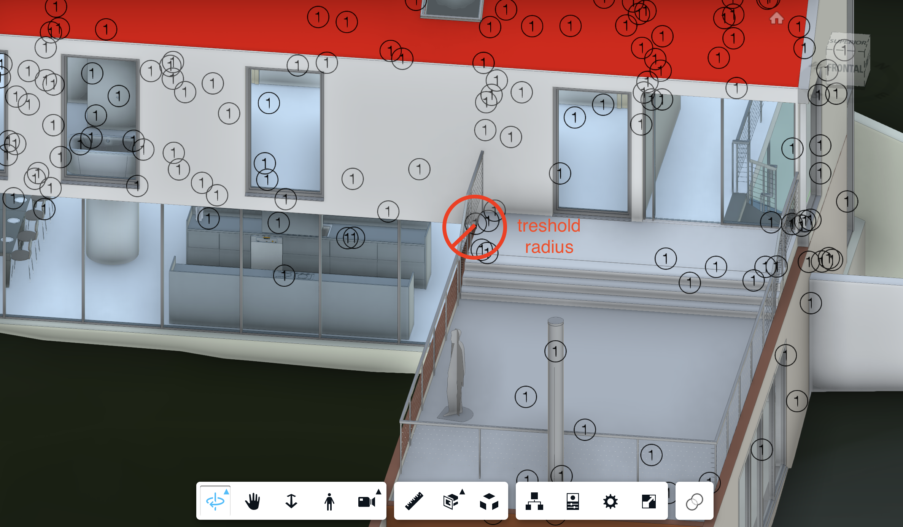
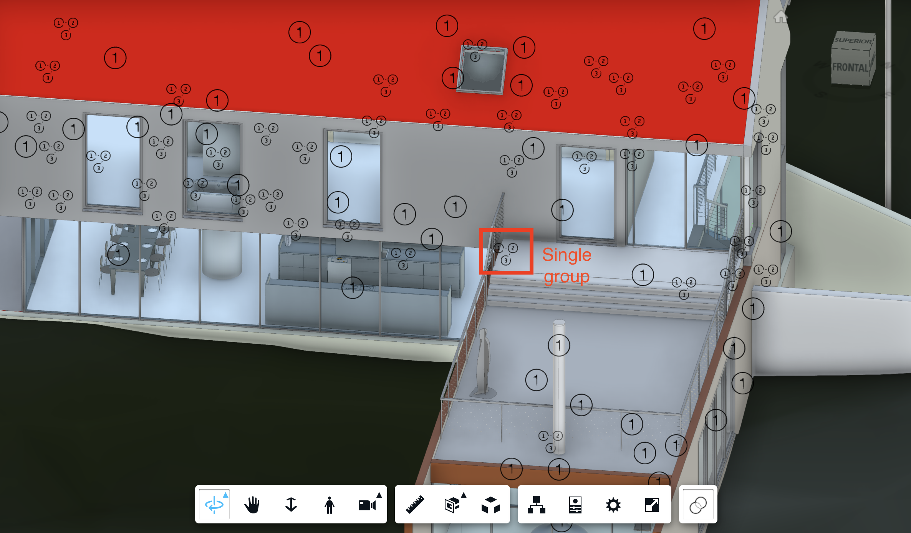

# Group sprites sample

This sample demonstrates how to group sprites to improve visualization in context of the APS Viewer.

### DEMO: https://joaomartins-callmejohn.github.io/grouplabels/

### Introduction

When we start adding labels to our scenes, we might get to a point where it gets too crowded.
It is at this point thet we need to think pf a way to improve visualization without limiting the amount of annotations added to the scene.
This is the goal of this sample. It shows a way to achieve that grouping sprites depending of the camera orientation.


### The approach

We choose to implement this approach with sprites, but the same logic can also be aplied to html markups or any other type of annotation, as long as it relies in points (in the scene or in the client).
With sprites, we can easily specify a size for our labels (in pixels), so they can adjust themselves based on the camera orientation (looking bigger in comparision with our scene elements).
So, to summarize, we'll take advantage of [sprites](https://aps.autodesk.com/en/docs/dataviz/v1/developers_guide/examples/sprites/) to add our labels and adjust our scene in a way thet it doesn't get too populated with labels, grouping them when necessary.

### The math behind the scene

To make it work, we'll need a way to group the label that are overlaping.

We'll need to reapply this strategy each time the camera changes, since its orientation defines the way we see the labels.

This comparision will consider the distance between the labels in a 2D context (client coordinates).

#### From 3D scene points to 2D points

First thing we need to to is converting the 3D points into 2D points relative to the client units in pixels.
This can be achieved with the help of viewer's [worldToClient](https://aps.autodesk.com/en/docs/viewer/v7/reference/Viewing/GuiViewer3D/#worldtoclient-point-camera) method.

#### Grouping the points

With that, we can go recursivelly through each point to separate them into groups that are close to each other (depending on the defined treshold).



In this sample we're doing that with the help of the snippet below:

```js
findIndexGroups(){
  let indexGroups = [];
  let indexesTaken = [];
  for(let i = 0; i <  spritesPositions.length; i++){
    if(!indexesTaken.includes(i)){
      let currentPosition = this.viewer.worldToClient( spritesPositions[i]);
      let notTakenPoints =  spritesPositions.filter(p => !indexesTaken.includes( spritesPositions.indexOf(p)));
      let pointsGroup = notTakenPoints.filter(p => this.viewer.worldToClient(p).distanceTo(currentPosition) < this.treshold);
      let indexGroup = pointsGroup.map(p =>  spritesPositions.indexOf(p));
      indexGroups.push(indexGroup);
      indexesTaken.push(...indexGroup);
    }
  }
  return indexGroups;
}
```

Where `spritesPositions` represent the array of 3D points.

Once the close points are defined, we can render themm using a specific icon for groups, while we use a different one for individual points.



We handle this part with the snippet below:

```js
renderSprites(dbId, indexGroups) {
  let DataVizCore = Autodesk.DataVisualization.Core;
  this.dataVizExtn.removeAllViewables();
  this.viewableData = new DataVizCore.ViewableData();
  this.viewableData.spriteSize = 32;

  for(let indexGroup of indexGroups){
    dbId++;
    let spritePoint;
    let spriteStyle;
    if(indexGroup.length > 1){
      spritePoint = this.findMiddlePoint(indexGroup);
      spriteStyle = this.pointStyles[1];
    }
    else{
      spritePoint =  spritesPositions[indexGroup[0]];
      spriteStyle = this.pointStyles[0];
    }
    let viewable = new DataVizCore.SpriteViewable(spritePoint, spriteStyle, dbId);
    this.viewableData.addViewable(viewable);
  }

  this.viewableData.finish().then(() => {
    this.dataVizExtn.addViewables(this.viewableData);
  });
}
```

#### Regroup on camera change

We need to repeat this process every time the camera changes, so we're basically trigerring this through the [CAMERA_CHANGE_EVENT](https://aps.autodesk.com/en/docs/viewer/v7/reference/Viewing/#camera-change-event)

The result from that can be seen by the gif below:


